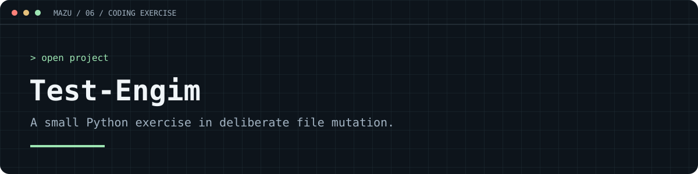

# A small exercise in changing text files

**Test-Engim** is a Python interview exercise that recursively visits a folder, removes randomly selected lines and replaces random characters in matching UTF-8 text files.

**Python 3 · Standard library only · Interview exercise**

> This function overwrites files in place. Run it only against a disposable folder of copied test files. There is no backup, undo or dry-run mode.

## How it works

1. Walk the target folder and its subfolders with `os.walk`.
2. Optionally filter files by extension.
3. Read each matching file as UTF-8; skip empty or unreadable files.
4. Remove a random selection of lines.
5. Replace selected non-newline characters with letters, digits or punctuation.
6. Write the result over the original file and print progress.

## Try it on disposable data

Clone the repository, then create a scratch directory and sample file from a Python shell:

```python
from pathlib import Path
from tempfile import mkdtemp
from script import cancella_righe

scratch = Path(mkdtemp(prefix="engim-demo-"))
sample = scratch / "sample.txt"
sample.write_text("First line\nSecond line\nThird line\n", encoding="utf-8")

cancella_righe(
    directory=str(scratch),
    estensioni=[".txt"],
    perc_lines=5,
    perc_chars=5,
)
print(sample.read_text(encoding="utf-8"))
```

Running `python script.py` alone does not mutate files: the example calls in the source are commented out.

## Parameters and edge cases

| Parameter | Default | Meaning |
| --- | --- | --- |
| `directory` | Required | Folder to scan recursively |
| `estensioni` | `None` | Extensions including the dot; `None` attempts every file |
| `perc_lines` | `5` | Percentage used to calculate deleted lines |
| `perc_chars` | `5` | Replacement probability for each remaining non-newline character |

At least **one line is removed from every nonempty matching file**, even when `perc_lines=0`. A one-line file becomes empty. Percentages are not range-validated and results vary between runs. These details describe the current implementation.
